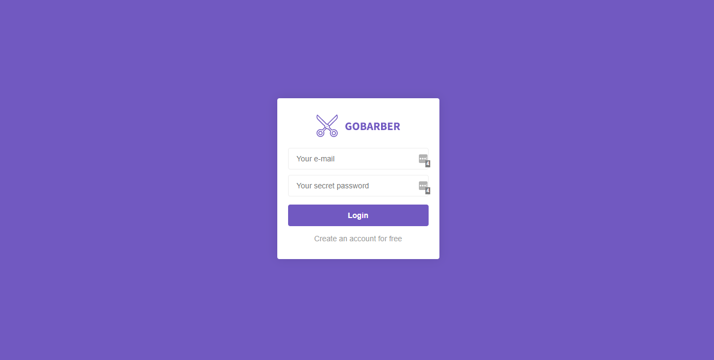

# GoBarber

> Node.js application for a fictional barber shop

## Main functionalities

- Login and authentication
- Schedule appointments
- Visualize scheduled appointments

## Knowledge and skills gained

- Routing with Express.js
- Encryption with bcrypt.js
- Session management with express-sessions and connect-loki
- Nunjucks - HTML templating engine
- ORM concepts and applications with Sequelize
- Postgres database and Docker
- MVC architecture
- EditorConfig and ESLint
